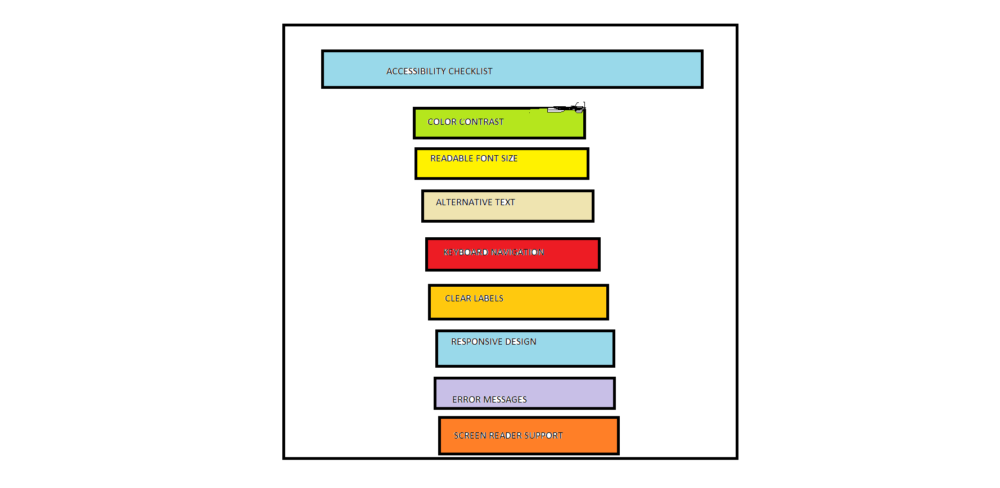
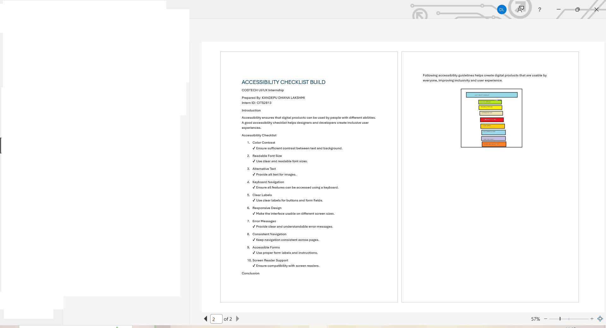
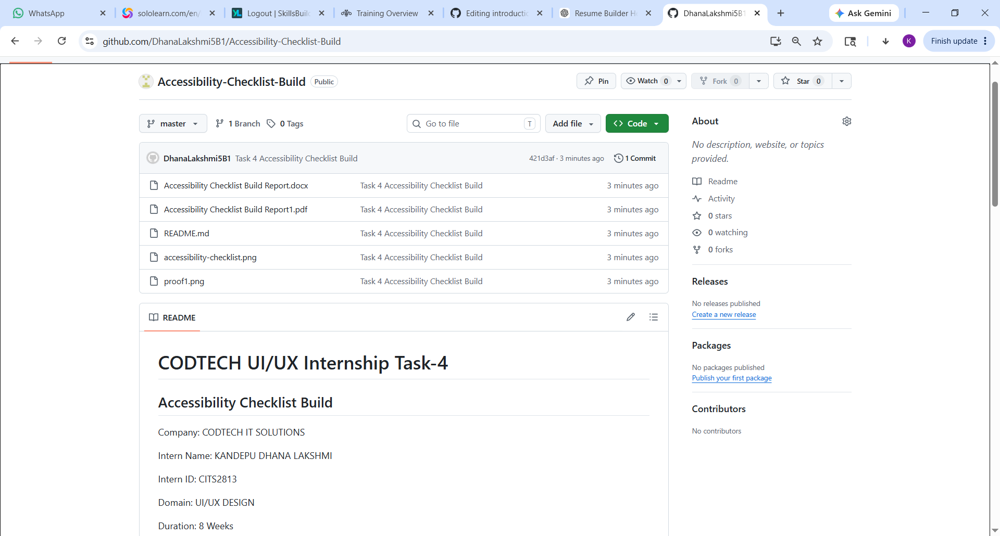

# CODTECH UI/UX Internship Task-4

## Accessibility Checklist Build

Company: CODTECH IT SOLUTIONS

Intern Name: TALLAM HARIKA

Intern ID: CITS2799

Domain: UI/UX DESIGN

Duration: 8 Weeks

Mentor Name: Neela Santosh Kumar

## Objective

The objective of this project is to create an accessibility checklist that helps improve usability and inclusivity in digital products.

## Description

This project provides a checklist of accessibility practices including color contrast, readable fonts, keyboard navigation, alternative text, responsive design, and screen reader support.

## Tools Used

* Microsoft Word
* Paint

## Files in Repository

* Accessibility Checklist Build Report.pdf
* accessibility-checklist.png
* proof1.png
* README.md

## Conclusion

Accessibility improves usability and ensures digital products can be used by a wider range of users.

## Proof of Execution

### Proof 1 – Accessibility Checklist

### Proof 2 – Report Document

### Proof 3 – GitHub Repository Upload

